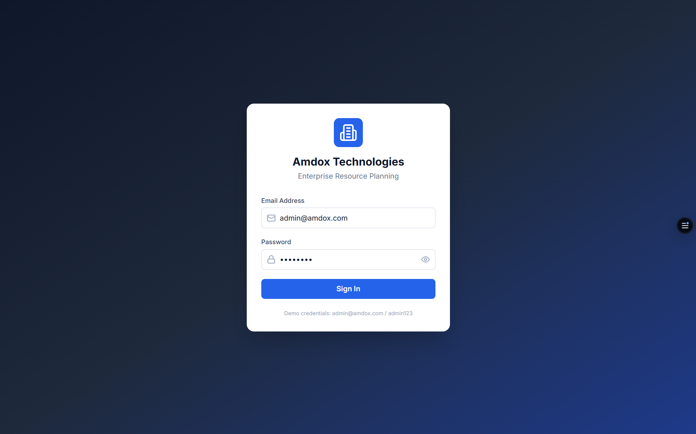
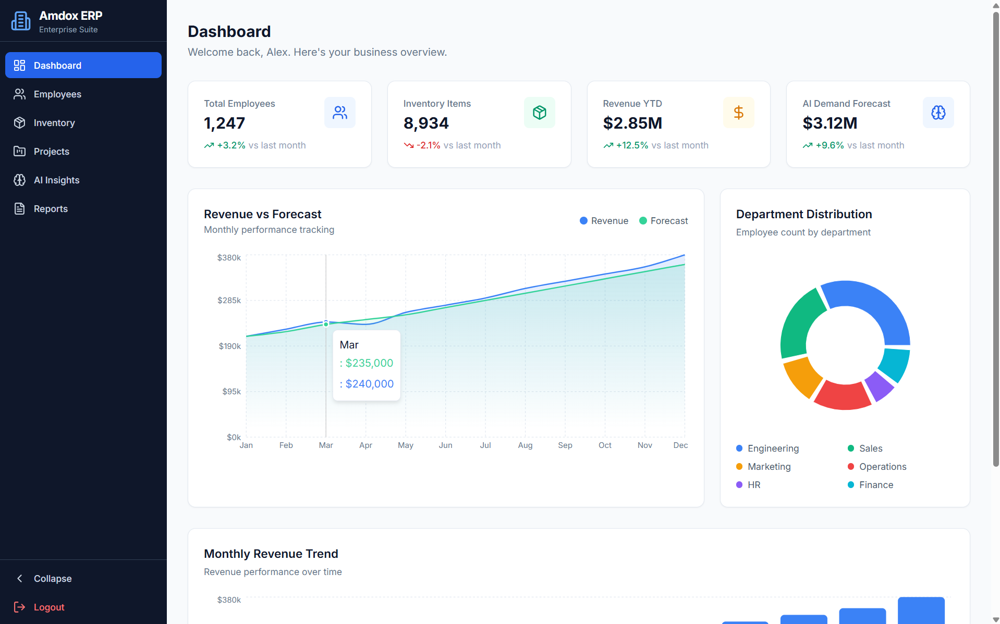
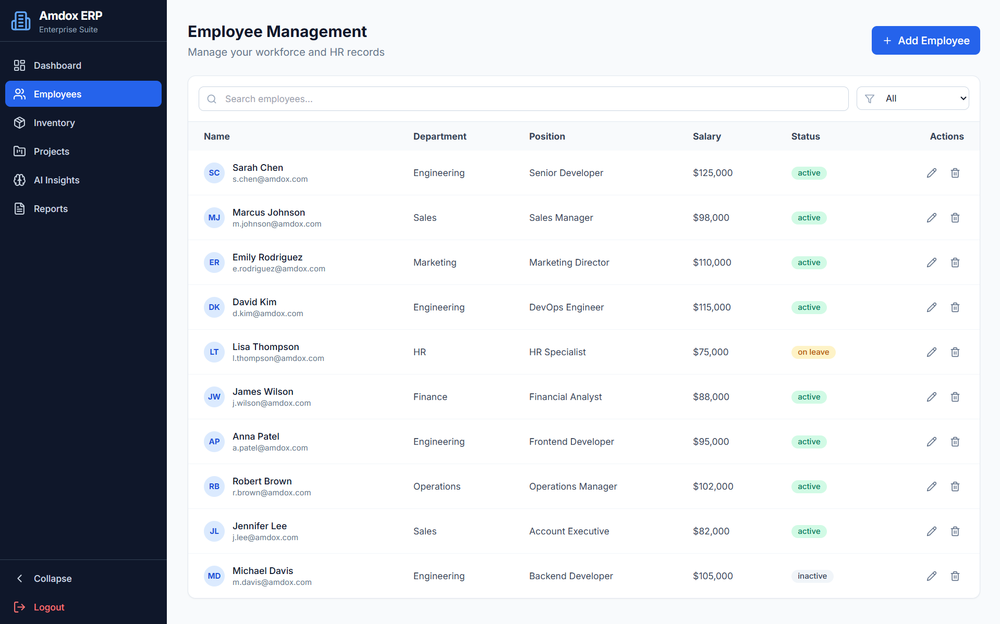
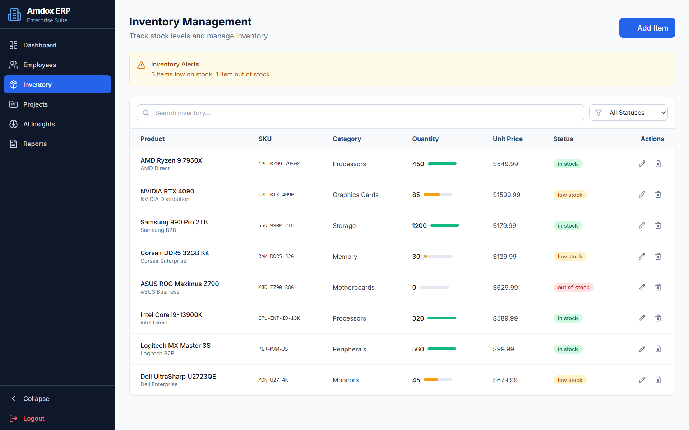
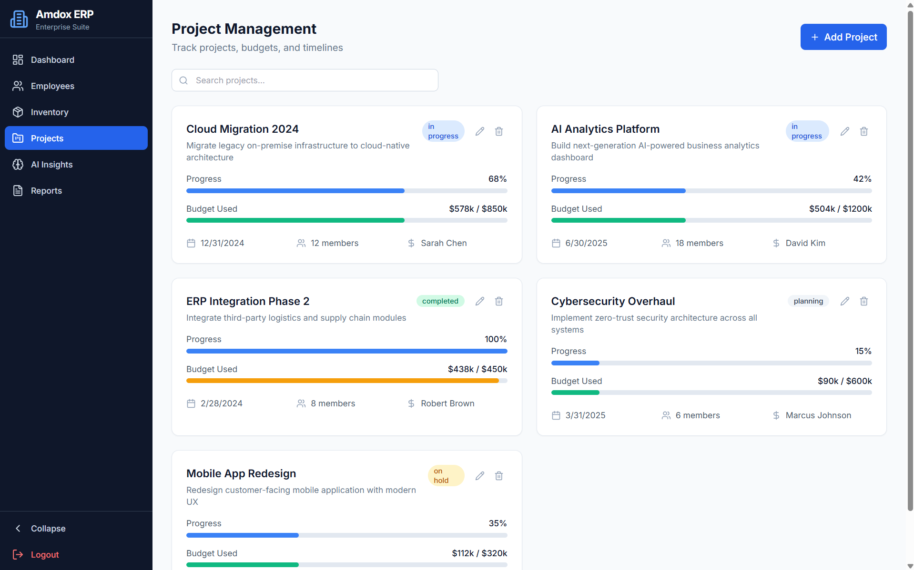
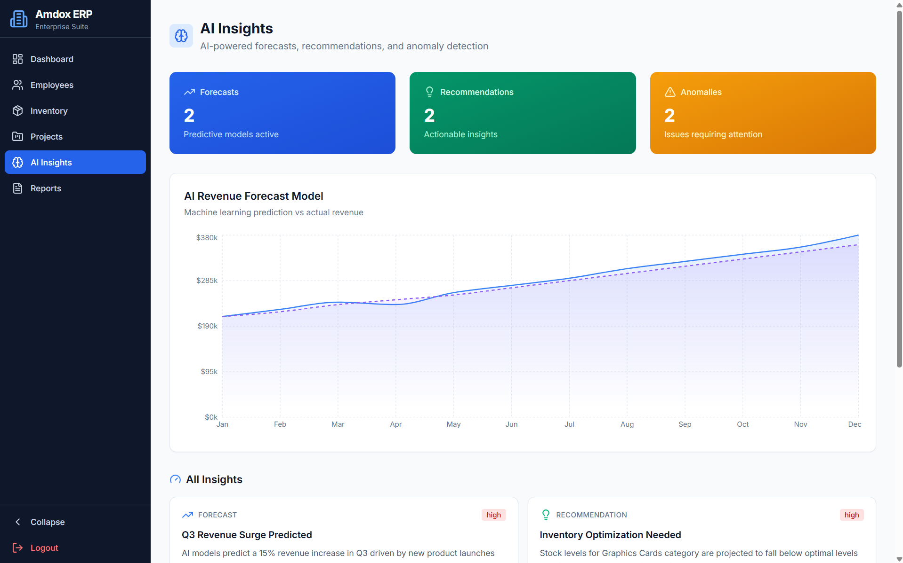
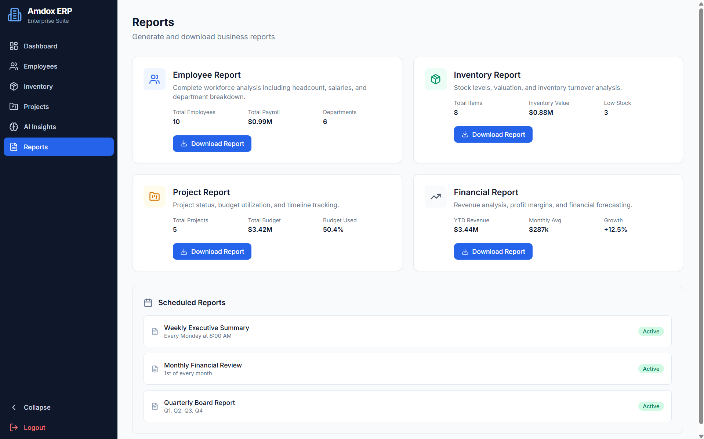

# 🚀 AI-Powered Cloud ERP Suite

A modern AI-powered Enterprise Resource Planning (ERP) web application built using **React, TypeScript, Vite, and Tailwind CSS** as part of my internship. The application provides an intuitive dashboard for managing employees, inventory, projects, reports, and AI-driven business insights through a responsive and user-friendly interface.

## 🌐 Live Demo

🔗 https://ai-powered-cloud-erp-suite.vercel.app

## ✨ Features

- 🔐 Secure Login Interface
- 📊 Interactive Dashboard
- 👥 Employee Management
- 📦 Inventory Management
- 📁 Project Management
- 🤖 AI Insights Dashboard
- 📈 Reports & Analytics
- 📱 Fully Responsive Design
- ⚡ Fast Performance with Vite

## 🛠️ Tech Stack

- React
- TypeScript
- Vite
- Tailwind CSS
- HTML5
- CSS3
- JavaScript (ES6)

## 🚀 Getting Started

### Clone the repository

```bash
git clone https://github.com/redishettysanjana/AI-Powered-Cloud-ERP-Suite.git
```

### Navigate to the project

```bash
cd AI-Powered-Cloud-ERP-Suite/project
```

### Install dependencies

```bash
npm install
```

### Start the development server

```bash
npm run dev
```

### Build for production

```bash
npm run build
```

## 📷 Screenshots

### 🔐 Login Page



### 📊 Dashboard



### 👥 Employee Management



### 📦 Inventory Management



### 📁 Project Management



### 🤖 AI Insights



### 📈 Reports



## 📌 Future Enhancements

- Authentication with backend integration
- Cloud database support
- Real-time analytics
- Role-based access control
- AI-powered predictive analytics
- Export reports as PDF/Excel
